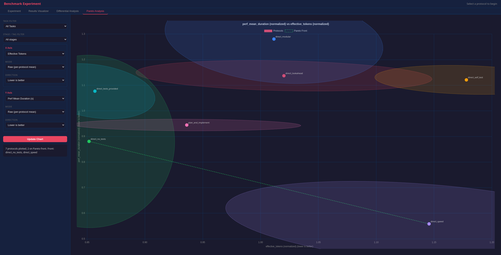

# Benchmarking Protocols



This repo centers around benchmarking different protocols for AI-assisted code development (in this case, focusing on Claude Code CLI). The idea is not to compare different models, but for a fixed model to compare different ways of working with it.

`python harness/run.py --ui` provides a web interface for running tasks and analyzing results.

We measure a variety of metrics:

- **Wall clock time**: How long it takes to develop
- **Effective tokens**: Estimate of tokens used to develop, weighted roughly by API costs (so cache reads are ~10x cheaper than cache writes)
- **Lines of Code**: How large the resulting programs are
- **Performance**: Each task includes some speed tests
- **Regressions**: How many things break between stages
- **Training vs Holdout accuracy**: We hide some unit tests from the LLM and can compare pass rates for exposed tests vs hidden ones
- **Task failure rate**: Sometimes the LLM itself will just fail to complete a task - these cases are separated out

We currently have four tasks and are adding more:

- **plotcurve**: A quick minimal task to make a curve plotter first for a quick function, then in the second stage to parse LaTeX expressions and plot the corresponding curve. Mostly here to test the harness.
- **minidb**: A task implementing a schema-free database in Python in six stages. The later stages are designed to invalidate assumptions implicit in previous stages, to test refactoring.
- **cellautomata**: A task to make a Conway's Game of Life simulator with a UI using PySide6, and then extend it to other CAs. Strongly sensitive to code optimization choices.
- **maze**: A task to make a web-based maze exploration game, tests UI and web development, as well as behavior when things are underspecified (the specific web technology is not specified, the maze procedural generation algorithm is not specified)

## Setup

Install all dependencies:

```bash
pip install -r requirements.txt
python -m playwright install chromium
```

The tasks have a variety of requirements:

| Dependency | Used by |
|------------|---------|
| pytest, fastapi, pyyaml | Core harness |
| PySide6, pytest-qt, numpy, scipy | CellAutomata |
| matplotlib, numpy | PlotCurve |
| playwright, Pillow | Maze |

You also need `git` and `python3` available on your PATH.

If you're seeing tasks fail with 0/N tests passed, it can be because of a missing install that Claude does not have permissions to correct.
